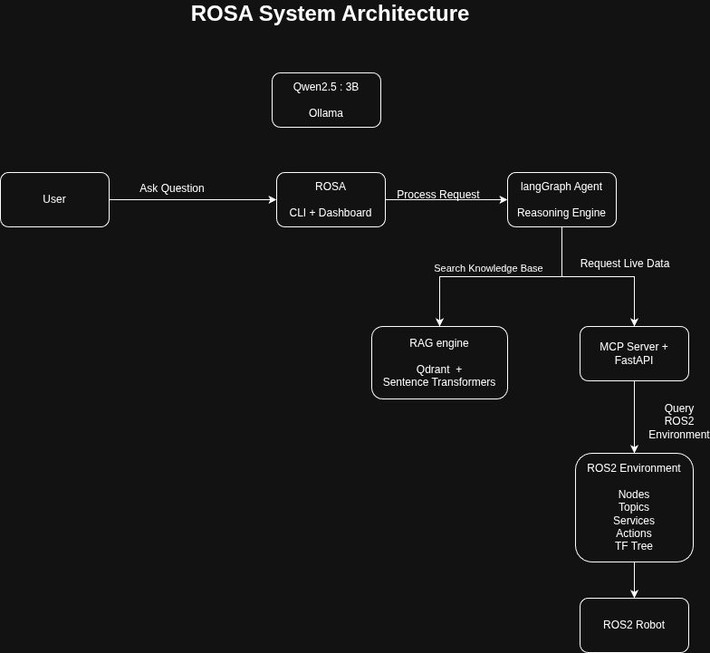

# 🤖 ROSA – ROS2 AI Assistant


### Your AI-Powered ROS2 Robotics Copilot

🌐 **Live Demo:** https://rosa-ros2-ai-assistant-production.up.railway.app

ROSA (ROS2 AI Assistant) is a free, locally hosted AI-powered assistant designed to help robotics developers diagnose, troubleshoot, and monitor ROS2 robot systems in real time.

Powered by local LLMs and integrated directly with ROS2, ROSA can inspect robot health, analyze logs, debug ROS2 nodes, query live robot data, and provide intelligent troubleshooting assistance without relying on paid APIs or cloud services.

---

## Features

* Natural language querying of live ROS2 system state
* Automated code fixing for broken ROS2 Python nodes
* Error log analysis with root cause diagnosis and fix suggestions
* Full robot health check covering nodes, topics, LiDAR, and odometry
* RAG pipeline with 200+ ROS2-specific knowledge entries
* Terminal CLI interface similar to AI coding assistants
* Streamlit web dashboard for visual interaction
* Compatible with any ROS2 robot, not limited to TurtleBot3

---

## Architecture

The system follows an AI-agent architecture where LangGraph coordinates reasoning, knowledge retrieval, and live robot inspection.



### Workflow

1. User sends a query through the terminal or dashboard.
2. ROSA forwards the request to the LangGraph agent.
3. LangGraph decides whether to:

   * Query the knowledge base (RAG)
   * Inspect live robot data through MCP
   * Generate a response using the local LLM
4. MCP retrieves live ROS2 information.
5. Qwen2.5 generates a contextual response.
6. ROSA returns diagnostics, fixes, or recommendations.

---

## Tech Stack

| Component            | Technology                      |
| -------------------- | ------------------------------- |
| AI Model             | Qwen2.5:3B                      |
| Local Inference      | Ollama                          |
| Cloud LLM            | Groq API (llama-3.1-8b-instant) |
| Agent Framework      | LangGraph + LangChain           |
| Knowledge Base       | Qdrant                          |
| Embeddings           | Sentence Transformers           |
| MCP Server           | FastAPI                         |
| Dashboard            | Streamlit                       |
| Robotics Middleware  | ROS2 Jazzy                      |
| Simulator            | Gazebo Sim 8                    |
| Programming Language | Python 3.10+                    |

---

## System Requirements

* Ubuntu 20.04+
* ROS2 Jazzy
* Python 3.10+
* Ollama
* 16 GB RAM recommended

---

## Installation

### Clone the Repository

```bash
git clone https://github.com/sneha-paul-2005/rosa-ros2-ai-assistant.git
cd rosa-ros2-ai-assistant
```

### Create and Activate a Virtual Environment

```bash
python3 -m venv venv
source venv/bin/activate
pip install -r requirements.txt
```

### Install Ollama and Pull the Model

```bash
curl -fsSL https://ollama.com/install.sh | sh
ollama pull qwen2.5:3b
```

---

## Usage

### Start the MCP Server

```bash
uvicorn mcp_server.main:app --reload --port 8000
```

### Run ROSA in Terminal

```bash
# Single question
python rosa.py "what nodes are active?"

# Fix broken code
python rosa.py "fix this code: self.publisher = self.create_publisher(String, 'topic')"

# Interactive mode
python rosa.py
```

### Run the Web Dashboard

```bash
streamlit run dashboard.py
```

---

## Project Structure

```text
rosa-ros2-ai-assistant/
│
├── rosa.py
├── dashboard.py
│
├── ai_agent/
│   └── agent.py
│
├── mcp_server/
│   └── main.py
│
├── rag/
│   ├── knowledge_base.py
│   └── rag_engine.py
│
├── docs/
│   └── architecture.png
│
└── README.md
```

---

## Use Cases

### Robotics Students

Learn ROS2 concepts and troubleshoot assignments faster.

### Robotics Researchers

Monitor and inspect robot systems in real time.

### ROS2 Developers

Diagnose failures and accelerate debugging workflows.

### Autonomous Robot Projects

Use ROSA as an intelligent monitoring and troubleshooting assistant.

---

## Contributing

Contributions are welcome.

Areas where help is especially appreciated:

* ROS2 knowledge base expansion
* Additional robot platform support
* Agent reasoning improvements
* Dashboard enhancements
* Deployment automation

### Steps

1. Fork the repository.
2. Create your feature branch.

```bash
git checkout -b feature/AmazingFeature
```

3. Commit your changes.

```bash
git commit -m "Add Amazing Feature"
```

4. Push the branch.

```bash
git push origin feature/AmazingFeature
```

5. Open a Pull Request.

---

## License

Distributed under the MIT License.

See the `LICENSE` file for additional information.

---

## Author

**Sneha Paul**

GitHub: https://github.com/sneha-paul-2005
